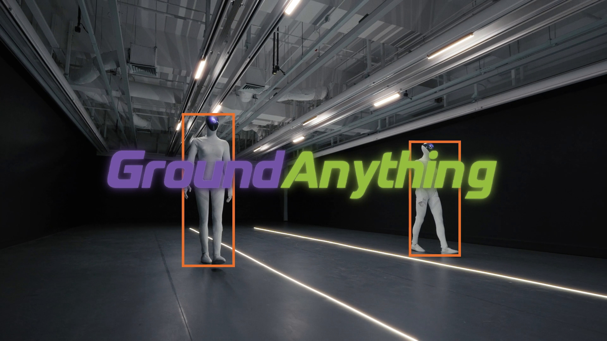

<h1 align="center"></h1>

<p align="center"><strong>Reconciling Parallel Decoding with Precise Visual Grounding at Flash Speed</strong></p>

<p align="center">
  <a href="#highlights"></a>
  <a href="#highlights"></a>
  <a href="#highlights"></a>
  <a href="#highlights"></a>
</p>

<p align="center">
  <a href="https://arxiv.org/abs/2609.39600"></a>
  <a href="https://huggingface.co/GroundingPI/GroundAnything"></a>
  <a href="https://huggingface.co/GroundingPI/GroundAnything-VLM"></a>
  <a href="https://huggingface.co/spaces/GroundingPI/GroundAnything-VLM"></a>
  <a href="https://groundingpi.github.io/groundanything/"></a>
  <a href="https://github.com/groundingpi/GroundAnything"></a>
</p>

<p align="center">
  <a href="#quick-start"></a>
  <a href="#vllm-deployment"></a>
  <a href="#deployment-options"></a>
  <a href="#batch-annotation"></a>
</p>

<p align="center"><a href="#demo">Demo Video</a> · <a href="#quick-start">Quick Start</a> · <a href="#documentation">Documentation</a> · <a href="#citation">Citation</a></p>

<p align="center"></p>

<a id="news"></a>

## 📰 News

- **2026-10-04:** Released the [project webpage](https://groundingpi.github.io/groundanything/).
- **2026-10-03:** Released the source code, deployment and batch-annotation guides, and full-suite evaluation workflows.
- **2026-10-01:** We released the [GroundAnything](https://huggingface.co/GroundingPI/GroundAnything) and [GroundAnything-VLM](https://huggingface.co/GroundingPI/GroundAnything-VLM) model weights on Hugging Face.
- **2026-09-30:** The [GroundAnything paper](https://arxiv.org/abs/2609.39600) is available on arXiv.

<a id="contents"></a>

## 🧭 Contents

[Highlights](#highlights) · [Demo](#demo) · [Models](#models) · [Installation](#installation) · [Deployment Options](#deployment-options) · [Quick Start](#quick-start) · [vLLM Deployment](#vllm-deployment) · [Batch Annotation](#batch-annotation) · [Tasks and Output Format](#tasks-and-output-format) · [Method and Inference Infrastructure](#method-and-inference-infrastructure) · [Evaluation](#evaluation) · [Training](#training) · [Results](#results) · [Documentation](#documentation) · [License](#license) · [Citation](#citation) · [Acknowledgement](#acknowledgement)

<a id="highlights"></a>

## ✨ Highlights

- **Unlocking diffusion for broad visual grounding.** We introduce GroundAnything, a 4B foundation model that unifies diverse grounding tasks with precise localization and parallel decoding, trained through grounding pretraining, AR-to-diffusion conversion with joint objectives, supervised fine-tuning, and GRPO-based reinforcement learning.
- **State-of-the-art grounding at 4B scale.** Across 30 benchmarks, GroundAnything surpasses the prior overall state of the art among similarly sized AR models and outperforms the larger Qwen3.7-Max. GroundAnything-VLM establishes a new overall state of the art at this scale and remains competitive with GPT-6 Astra.
- **Systematic acceleration studies.** We analyze decoding strategies in detail, compare with MTP-based generation, and evaluate progressive infrastructure optimizations for practical deployment.

<a id="demo"></a>

## 🎬 Demo

<p align="center"><a href="https://huggingface.co/GroundingPI/GroundAnything/resolve/d1819bbe01b5a16cebd67ecaca207d2696e3af59/assets/demo.mp4"></a></p>

[▶ Watch the demo](https://huggingface.co/GroundingPI/GroundAnything/resolve/d1819bbe01b5a16cebd67ecaca207d2696e3af59/assets/demo.mp4)

[▶ Parallel Decoding](https://huggingface.co/GroundingPI/GroundAnything/resolve/0f8e30894c3ca86378d01ae51ec69c217c78151b/assets/decoding.mp4)

<a id="models"></a>

## 🤗 Models

| Checkpoint | Generation | Download | Evaluation mode |
|:---|:---|:---|:---|
| **GroundAnything** | Entropy-guided diffusion; optional self-speculation | [DLM weights](https://huggingface.co/GroundingPI/GroundAnything) | **GAM** |
| **GroundAnything-VLM** | Autoregressive generation | [VLM weights](https://huggingface.co/GroundingPI/GroundAnything-VLM) | **GAM** |

GroundAnything's main results use entropy-guided decoding. GroundAnything-VLM is a separate autoregressive checkpoint. Both use the **GAM** evaluation mode.

<a id="installation"></a>

## 🛠️ Installation

The serving workflows below target **Linux x86_64 and Python 3.12**. The serving setup installs the bundled custom **SGLang** engine and its pinned dependencies. The supplied serving profile uses Torch **2.9.1**, Transformers **5.5.4**, Triton **3.5.1**, sgl-kernel **0.3.20**, and FlashInfer **0.5.3**.

```bash
git clone https://github.com/groundingpi/GroundAnything.git
cd GroundAnything
python3 -m pip install -r requirements.txt huggingface_hub
```

Already have a source checkout? Start with `cd GroundAnything`. Run subsequent commands from the repository root.

`requirements.txt` installs the lightweight HTTP client, visualization tools, and setup dependencies. Serving, training, and evaluation each use their own environment; `pip install -r requirements.txt` alone does not install the model runtime. The client does not load weights and requires no Torch installation.

**Tested accelerators:** NVIDIA **B300, B200, H200, H800**, and **PPU**. Use the matching runtime for each accelerator. See [Environment Setup](environments/README.md) for installation details.

<a id="deployment-options"></a>

## 🧩 Deployment Options

| Model | Backend | Use case | Guide |
|:---|:---|:---|:---|
| GroundAnything (DLM) | **Custom SGLang** | Entropy-guided parallel or self-speculative decoding | [DLM quick start](#quick-start) |
| GroundAnything-VLM | **Custom SGLang** | Autoregressive grounding with the existing service | [VLM quick start](#groundanything-vlm-autoregressive-decoding) |
| GroundAnything-VLM | **vLLM + Transformers backend** | An alternative autoregressive serving route | [GPU / PPU deployment](docs/VLLM.md) |

Use the repository's patched engines and launchers. The new vLLM adapter is for **GroundAnything-VLM only** and has CPU-level checks; end-to-end accelerator validation is pending. DLM decoding stays on SGLang.

All routes expose an **OpenAI-compatible image + text API** and produce structured visual grounding. Prompts cover referring expressions, object localization, text-region grounding, document layout, and point localization. See [Tasks and Output Format](#tasks-and-output-format) for the prompt and coordinate contract. For processing an image collection, start with [Batch Annotation](#batch-annotation).

<a id="quick-start"></a>

## 🚀 Quick Start

<a id="groundanything-entropy-guided-decoding"></a>

### ⚡ GroundAnything: entropy-guided decoding

Download the complete DLM release and start the service:

```bash
hf download GroundingPI/GroundAnything --local-dir weights/dlm_bundle
python3 run.py setup serve
python3 run.py serve --decoder denoise
```

The published checkpoint is already a complete model bundle, so it does **not** require `prepare-model`. The supplied SGLang installer is a **CUDA/GPU** recipe; PPU requires its matching platform runtime.

<a id="groundanything-self-speculative-decoding"></a>

### 🚀 GroundAnything: self-speculative decoding

Stop the existing DLM service, then reuse the same weights with:

```bash
python3 run.py serve --decoder speculative
```

<a id="groundanything-vlm-autoregressive-decoding"></a>

### 🔁 GroundAnything-VLM: autoregressive decoding

Download the separate autoregressive checkpoint. If the serving environment has not yet been prepared, run `python3 run.py setup serve` first.

```bash
hf download GroundingPI/GroundAnything-VLM --local-dir weights/vlm
python3 run.py serve --config configs/release/vlm_sglang.yaml
```

| Service | Base URL | Model ID |
|:---|:---|:---|
| GroundAnything, either DLM decoder | `http://127.0.0.1:8101/v1` | `groundinganything` |
| GroundAnything-VLM | `http://127.0.0.1:8102/v1` | `groundinganything-vlm` |

<a id="run-a-prediction"></a>

### 🎯 Run a prediction

Keep the service running. In a second terminal, use the environment where you installed `requirements.txt` and replace `your_image.jpg` with your image:

```python
from grounding_anything import GroundingAnything, visualize

client = GroundingAnything(
    base_url="http://127.0.0.1:8101/v1",
    model="groundinganything",
)

# Referring-expression grounding
result = client.predict("your_image.jpg", "the red car", task="bbox")
print(result.to_dict())
if result.valid:
    visualize("your_image.jpg", result).save("prediction.png")

# Point localization
point = client.predict(
    "your_image.jpg", "the center of the red car", task="point"
)
print(point.to_dict())
```

For **GroundAnything-VLM**, use the same client with `base_url="http://127.0.0.1:8102/v1"` and `model="groundinganything-vlm"`.

The command-line example saves `result.json` and, for valid output, `prediction.png`. Choose a new output directory for each run:

```bash
python3 examples/predict.py \
  --image your_image.jpg --phrase "the red car" \
  --task bbox --output outputs/car
```

For the VLM service, append `--base-url http://127.0.0.1:8102/v1 --model groundinganything-vlm`.

<details>
<summary>Client parameters and return values</summary>

| Interface | Parameters |
|:---|:---|
| `GroundingAnything(...)` | `base_url`, `model`, optional `api_key`, `timeout` (default: 120 seconds) |
| `predict(...)` | Image path (JPEG, PNG, WebP), referring phrase, `task="bbox"` or `"point"`, `max_tokens` (default: 4096) |
| `visualize(...)` | Image path and a valid result; returns a Pillow image |

`result.to_dict()` contains `task`, `predictions`, `raw_output`, `finish_reason`, `usage`, `parse_error`, and `valid`. Parsed predictions contain labels and coordinates on a **0–999** grid. The visualizer converts them to image pixels. Truncated or malformed responses have `valid=False` and retain their raw output for inspection.

</details>

See [Examples](examples/README.md) and the [client implementation](grounding_anything/client.py) for more usage details.

<a id="vllm-deployment"></a>

## ⚡ vLLM Deployment

**GroundAnything-VLM** also has an opt-in **vLLM Transformers-backend** adapter for autoregressive grounding. Its dedicated `.venv-vllm` environment uses **Linux x86_64 / Python 3.12**, a preinstalled accelerator-compatible **Torch / vLLM 0.18.x** runtime, and the bundled **Transformers 5.7.0 fork**. The default SGLang environment remains separate.

For **NVIDIA GPUs**, run from the repository root:

```bash
hf download GroundingPI/GroundAnything-VLM --local-dir weights/vlm
python3 run.py setup vllm --platform gpu
python3 run.py serve --engine vllm --platform gpu
```

For **PPU**, run inside the matching vendor runtime image and replace `gpu` with `ppu` in both setup and serving commands. Skip setup if `.venv-vllm` is already prepared. Use the same `--venv` on both commands to select another fresh environment.

The API is **`http://127.0.0.1:8102/v1`**, with model ID **`groundinganything-vlm`**. Stop an existing SGLang VLM service on that port before starting vLLM, or choose a different port in the vLLM release configuration. Check readiness in another terminal:

```bash
curl --fail http://127.0.0.1:8102/v1/models
```

Defaults are **BF16, eager execution, TP=1, one active sequence, 16,384 context tokens, and one image per request**. Custom requests must include **`skip_special_tokens: false`** and **`spaces_between_special_tokens: false`**. Evaluate with **GAM** mode using `configs/eval/vlm_vllm.yaml`.

GroundAnything's **DLM entropy-guided and self-speculative decoders use the custom SGLang backend**; the vLLM route accepts only the separate VLM checkpoint. This new adapter has CPU-level checks; end-to-end accelerator validation is pending. See the [vLLM Deployment Guide](docs/VLLM.md) for GPU/PPU setup, a complete image request, and configuration details.

<a id="batch-annotation"></a>

## 🗂️ Batch Annotation

Use the [JSONL batch guide](docs/BATCH_INFERENCE.md) to annotate image collections with per-image grounding prompts. The [batch example](examples/batch_predict.py) saves raw responses, parsed coordinates, completion status, and usage; successful items can be skipped when resuming the same inputs and request configuration.

With a service running and your input manifest prepared:

```bash
python3 examples/batch_predict.py \
  --input requests.jsonl --output predictions.jsonl \
  --base-url http://127.0.0.1:8101/v1 --model groundinganything
```

The supplied serving profiles use **one active sequence**. Batch processing here means sequential image requests with durable output. For multiple accelerators, split the manifest across independent service replicas and use a separate output file per worker. Inspect truncated or invalid results before using predictions as annotations.

<a id="tasks-and-output-format"></a>

## 🎯 Tasks and Output Format

The models accept one image and a text instruction. The convenience client's `predict()` method constructs referring-box and referring-point prompts. For other tasks, send the corresponding prompt to the service's OpenAI-compatible `/v1/chat/completions` endpoint.

| Task | Prompt |
|:---|:---|
| Object / dense grounding | `Locate all the instances that match the following categories: car</c>person.` |
| Referring boxes | `Locate the target referred to by the following description: the red car.` |
| Object points | `Point to: car</c>person.` |
| Referring points | `Point to the target referred to by the following description: the red car.` |
| OCR | `OCR task detect all the text in box format.` |
| Document layout | `Detect all document layout elements that match the following categories: title</c>text.` |
| GUI grounding | `Point to the UI element to click for the following instruction: open the settings menu.` |
| Visual prompting | Provide reference boxes in the native spatial-token format, then request similar objects. |

<details>
<summary>Visual-prompt example</summary>

```text
Given reference boxes <|box_start|><100><200><500><650><|box_end|> indicating one or more objects, find all similar objects in the image and output their bounding boxes.
```

</details>

All released checkpoints use the **GAM spatial-token protocol**, with integer coordinates from **0 to 999**. Boxes contain `(x1, y1, x2, y2)`; points contain `(x, y)`. A missing target is represented by `None`.

```text
<|object_ref_start|>car<|object_ref_end|><|box_start|><100><200><500><650><|box_end|>
<|object_ref_start|>car center<|object_ref_end|><|box_start|><300><425><|box_end|>
<|object_ref_start|>absent object<|object_ref_end|><|box_start|>None<|box_end|>
```

Use the checkpoint's tokenizer, processor, and chat template. Custom HTTP requests should keep `skip_special_tokens=false`, preserve adjacent coordinate tokens without added spaces, and send the image as a base64 data URI in an `image_url` content part alongside the text prompt.

<a id="method-and-inference-infrastructure"></a>

## ⚙️ Method and Inference Infrastructure

The variants share a MoonViT-V2 (Kimi K3) visual encoder, a multimodal projector, and a Qwen3-4B language architecture.

<p align="center"></p>


<a id="entropy-guided-decoding"></a>

### ⚡ Entropy-guided decoding

The release recipe uses **block size 32**, **sub-block size 4**, and **entropy threshold 0.8**. Each physical block contains a known anchor and 31 masked positions.

After image/query prefill, GroundAnything denoises response blocks with bidirectional attention and caches the completed prefix. Sub-blocks are processed from left to right. Our default *Entropy-Guided Decoding* commits masked positions with $H_j\leq\tau$, where $H_j=-\sum_v p_j(v)\log p_j(v)$ is the entropy of the unmodified token distribution. If none qualifies, the lowest-entropy position is committed to ensure progress. Committed tokens remain fixed, and a causal pass constructs the completed block's cache without AR verification.

<a id="self-speculative-decoding"></a>

### 🚀 Self-speculative decoding

The shared weights also support diffusion drafting with causal verification, accepting the longest matching prefix. Verification accepts only the longest consecutive draft prefix agreeing with the causal predictions. The first disagreement ends acceptance; later coincidental matches are discarded. Rejected suffix states are removed from the cache.

Self-speculation verifies against the converted model's causal branch. Exact greedy verification preserves that branch's outputs, not necessarily the outputs of the separately trained GroundAnything-VLM.

The documented `--decoder speculative` route uses **linear drafting and greedy verification**.

<p align="center"></p>


<a id="sglang-cuda-graph-and-fp8"></a>

### ⚙️ SGLang, CUDA Graph, and FP8

The implementation progresses from Native PyTorch (Eager) to SGLang (Eager), CUDA Graph replay, and selective FP8 execution. Denoising and causal passes retain their respective attention and cache semantics. FP8 applies to eligible language-model linear operations, with the remaining components kept in BF16. These changes reduce execution overhead or arithmetic cost; quantization can still alter logits and decoding decisions.

The default DLM service uses **BF16**, **Triton attention**, **eager execution**, **one GPU**, **one active request**, and **two queued requests**. Client concurrency queues requests; use independent replicas for higher service concurrency.

| Execution option | Purpose | Supplied default |
|:---|:---|:---|
| SGLang eager | Integrated scheduling, attention kernels, and cache ownership | **Enabled** |
| CUDA Graph replay | Reduce repeated GPU launch overhead for compatible captured work | **Disabled**; studied in the paper |
| Selective FP8 | Accelerate eligible language-model linear operations | **Disabled**; default inference remains BF16 |

<details>
<summary>CUDA Graph implementation details</summary>

The optional implementation captures fixed-shape block work. The FlashInfer path uses persistent attention masks and device-resident buffer updates; the Triton verifier uses separate draft/verification metadata and input buffers with shared model parameters and KV storage. The supported capture case is B32 with one request and no tensor, pipeline, or data parallel expansion. Prefill and unsupported shapes use eager execution.

Graph replay preserves the active decoding algorithm. Selective FP8 is a separate numerical configuration and may change logits and token decisions. The paper compares these infrastructure optimizations within the same decoding mode. The release launcher does not expose a `--cuda-graph` switch.

</details>

Use the bundled engine and serving profile. Installing upstream SGLang alone does not provide these model and decoding integrations. See [Inference](docs/INFERENCE.md) for configuration and the native reference route.

<a id="evaluation"></a>

## 📈 Evaluation

The GroundAnything evaluation suite covers the **30 benchmarks** reported in the paper. The [Evaluation Guide](eval/README.md) provides the data link, path setup, the exact 30-task selection, input validation, and full-suite execution.

The shared evaluator supports **7 modes**:

| Mode | Supported models |
|:---|:---|
| **`GAM`** | **GroundingPI, GroundAnything, GroundAnything-VLM** |
| `VLM` | Generic vision-language baselines |
| `REXOMNI` | Rex-Omni |
| `LOCATEANYTHING` | LocateAnything |
| `GROUNDINGDINO` | GroundingDINO through a compatible service |
| `DLM` | Legacy diffusion checkpoints using the GAM protocol |
| `RLV2` | Legacy RL checkpoints using the GAM protocol |

**Use GAM mode for all three released checkpoints.** Start the model service and configure the data paths before running:

```bash
python3 run.py setup eval
# Select the route matching the service that is already running.
python3 run.py eval --decoder denoise
python3 run.py eval --decoder speculative
python3 run.py eval --config configs/eval/vlm.yaml
```

The shipped recipes are **8-sample smoke tests** for selected tasks. For the complete 30-benchmark suite, follow the [full evaluation walkthrough](eval/README.md#full-suite): it selects the paper's task list, uses `limit: null`, and writes results under a fresh `run_id`. Evaluation connects to an existing service and does not start or switch its decoder.

<a id="training"></a>

## 🏋️ Training

Training runs in its own environment. Prepare the complete model files, tokenizer, validated input caches, and manifests before launching. The supplied training recipe targets **H800-class CUDA GPUs**, with a pinned CUDA toolchain and source-built FlashAttention. See [Environment Setup](environments/README.md) for the matching runtime and dependencies.

<a id="choose-a-training-stage"></a>

### 🧩 Choose a training stage

| Stage | Native configuration | Launch configuration |
|:---|:---|:---|
| General | [`general.yaml`](configs/train/general.yaml) | [`general_train.yaml`](configs/release/general_train.yaml) |
| Specialist | [`specialist.yaml`](configs/train/specialist.yaml) | [`specialist_train.yaml`](configs/release/specialist_train.yaml) |
| SFT 1 | [`sft1.yaml`](configs/train/sft1.yaml) | [`sft1_train.yaml`](configs/release/sft1_train.yaml) |
| SFT 2 | [`sft2.yaml`](configs/train/sft2.yaml) | [`sft2_train.yaml`](configs/release/sft2_train.yaml) |

Set the base-model path, matching tokenizer, prepared inputs, output directory, batch size, and sequence length in the native configuration. Set the distributed topology and initial checkpoint in the launch configuration. **Keep the training mode as `DLM`; `GAM` is the evaluation mode.**

The supplied stage templates target **8 nodes × 8 devices**. Adjust `nnodes`, `nproc_per_node`, `node_rank`, `master_addr`, and `master_port` for your cluster, and keep the runtime checks and packing manifest consistent with the chosen world size and batch size.

```bash
python3 run.py setup train

# Inspect the configured training command before launching.
.venv-train/bin/python scripts/run.py configs/release/sft1_train.yaml --dry-run

# Run on each node with its corresponding launch configuration.
python3 run.py train --config configs/release/sft1_train.yaml
```

Training consumes prepared caches and manifests for sampling, length/image checks, response lengths, and packing. These inputs must be prepared before launch; a generic JSONL-to-training-cache converter is not included. See [Data Preparation](docs/DATA_PREPARATION.md).

<a id="initialize-or-resume-a-checkpoint"></a>

### 🔄 Initialize or resume a checkpoint

| Launch setting | Behavior |
|:---|:---|
| `checkpoint.initial_dlm_checkpoint` | Load DLM weights for a new stage with a new optimizer and scheduler |
| `checkpoint.resume_from_checkpoint` | Resume a complete training checkpoint, including optimizer, scheduler, and training state |

Choose one of these settings. To fine-tune the released DLM, use the complete `weights/dlm_bundle` as the initial DLM checkpoint and set the native `model.path` to the matching autoregressive base model, with its tokenizer. To resume SFT, update its launch YAML and rerun `python3 run.py train --config ...`; the top-level `--resume` shortcut selects the smoke-test recipe.

The [Training Guide](docs/TRAINING.md) also covers optional reinforcement learning. After training, export a fresh complete inference bundle using the [Inference Guide](docs/INFERENCE.md). The published Hugging Face DLM bundle is already prepared for inference.

<a id="results"></a>

## 📊 Results

<p align="center"></p>


[Paper and supplementary material](https://arxiv.org/abs/2609.39600).

<a id="documentation"></a>

## 📚 Documentation

| Guide | Contents |
|:---|:---|
| [Environment Setup](environments/README.md) | Workflow environments and platform prerequisites |
| [Inference](docs/INFERENCE.md) | Serving, model preparation, configuration, and reference backend |
| [vLLM Deployment](docs/VLLM.md) | GPU / PPU setup, container starting point, and image API requests |
| [Batch Annotation](docs/BATCH_INFERENCE.md) | Resumable JSONL predictions for image collections |
| [Examples](examples/README.md) | Image prediction, JSON output, and visualization |
| [Evaluation](eval/README.md) | Dataset setup, paper benchmark suite, execution, and results |
| [Training](docs/TRAINING.md) | Training recipes, distributed settings, and checkpoints |
| [Data Preparation](docs/DATA_PREPARATION.md) | Input formats and local preparation requirements |
| [Third-party Sources](third_party/README.md) | Bundled frameworks and provenance |

```text
GroundAnything/
├── run.py                  # Workflow launcher
├── grounding_anything/       # Lightweight HTTP client and visualization
├── configs/                # Serving, training, and evaluation recipes
├── infer/                  # Model services and decoding
├── train/                  # Training workflows
├── eval/                   # Tasks, prompts, requests, and metrics
├── models/                 # Model definitions
├── examples/               # Prediction examples
├── environments/           # Environment installers
└── docs/                   # Detailed guides
```

Use `python3 run.py --help` to inspect the command-line interface. Full model workflows run from the source tree; the Python package installs the independent HTTP client.

<a id="license"></a>

## 📜 License

Original project contributions are available under the [Apache License 2.0](https://www.apache.org/licenses/LICENSE-2.0), with no additional restrictions imposed by this project. This grant covers only rights held by the contributing authors.

Third-party material retains its applicable licenses, including the [Kimi K3 License](licenses/Kimi-K3.txt) for Kimi-derived material and applicable derivative works. These upstream conditions remain in force. See [Third-party Notices](THIRD_PARTY_NOTICES.md) for component attribution and the [released model's license scope](https://huggingface.co/GroundingPI/GroundAnything/blob/main/LICENSE) for the model package.

<a id="citation"></a>

## 📖 Citation

If this work supports your research, please cite:

```bibtex
@misc{yu2026groundanythingreconcilingparalleldecoding,
  title = {{GroundAnything}: Reconciling Parallel Decoding with Precise Visual Grounding at Flash Speed},
  author = {Qize Yu and Lianrui Fan and Bowen Ping and Xini Ding and Zetian Song and Junbo Niu and Kaixuan Wang and Tianxing Chen and Yue Chen and Minghua He and Yuran Wang and Jie Huang and Haojun Zhang and Min Chen and Hao Li and Wenxuan Song and Ruihai Wu and Xianming Liu and Shilong Liu and Shuchang Zhou and Ping Luo and Shiyu Huang},
  year = {2026},
  eprint = {2609.39600},
  archivePrefix = {arXiv},
  primaryClass = {cs.CV},
  url = {https://arxiv.org/abs/2609.39600},
}
```

<a id="acknowledgement"></a>

## 🙏 Acknowledgement

We thank the teams behind [Rex-Omni](https://github.com/IDEA-Research/Rex-Omni) and [LocateAnything](https://github.com/NVlabs/Eagle/blob/main/Embodied/README.md) for sharing their work and open-source implementations.
